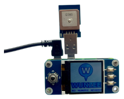

Wunzee
============
Little helper that shows munzees near you. Based on python and a sqlite database, which must be filled by yourself. Very helpful for fast capture of bouncers.  

### Hardware
- Raspberry Pi Zero WH [BerryBase](https://www.berrybase.de/raspberry-pi/raspberry-pi-computer/boards/raspberry-pi-zero-wh)
- Display: Waveshare Raspberry Pi 128x128 Pixels 1.44inch LCD [Amazon](https://www.amazon.de/gp/product/B077YK8161/)
- GPS: Stemedu VK172 G-Mouse USB [Amazon](https://www.amazon.de/gp/product/B07LC76TVG/
- OTG Adapter [BerryBase](https://www.berrybase.de/raspberry-pi/raspberry-pi-computer/kabel-adapter/usb-kabel-adapter/super-tiny-usb-2.0-hi-speed-otg-adapter-a-buchse-micro-b-stecker)
- microSD ~2GB
- USB Power Cable (with angled plug, because of fitting): [Amazon](https://www.amazon.de/gp/product/B00Z6L0JD6/)
- Powerbank or other power source (USB)

*All links are to german shops without getting any money for it. You can buy the items wherever you want.*

### Installation
see: [installation.md](installation.md)
 

#####External Sources
- Display: [LCD Driver by Waveshare](https://www.waveshare.com/wiki/1.44inch_LCD_HAT)
- Font: [Pixel Emulator by Pixel Sagas](https://www.dafont.com/pixel-emulator.font)