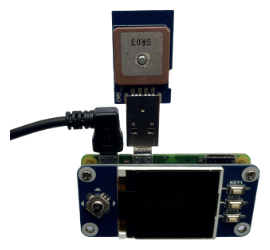

Wunzee - Installation
============

## Hardware
Put everything together:

*Do not insert the empty sd card nor power your device on.*

## 1. Preparations 
- install Raspberry Pi OS Lite on the microSD: [Raspberry Pi Imager](https://www.raspberrypi.org/blog/raspberry-pi-imager-imaging-utility)
- connect the device to your network: create a file called *wpa_supplicant.conf* in the root directory of the sd card with your network credentials like described here: [WLAN connection](https://www.raspberrypi.org/documentation/configuration/wireless/headless.md)
- allow the remote access: create an empty file called *ssh* in the root directory of the sd card (no need to open this link, just for information: [SSH remote access](https://www.raspberrypi.org/documentation/remote-access/ssh/README.md))

## 2. Raspberry Pi
- put the sd card in the raspberry and power it on
- your raspberry will need a few minutes to power on and connect to your network
- use a network scanner or look into your router to find the IP address of your raspberry
- connect to using a ssh client (Windows: [Putty](https://www.chiark.greenend.org.uk/~sgtatham/putty/latest.html), Linux / OS X: build-in shell) it with the ip you just found out - user: **pi** / password: **raspberry**

## 3. first steps on device
- change the password with `passwd` from raspberry to anything you want (and can remember later)
- load the update list: `sudo apt update`
- update the device: `sudo apt upgrade`

## 4. install python and dependencies
- `sudo apt install python python-numpy python-qrcode python-serial python-requests python-pip`
- `pip install vincenty`

## 5. display driver installation
- `sudo raspi-config` and choose `Interfacing Options -> SPI -> Yes`

## 6. install wunzee
- install git: `sudo apt install git`
- install wunzee from github: `git clone https://github.com/cixio/wunzee.git`
- run wunzee: `python wunzee/wunzee.py`

## 7. autostart wunzee on power on and restart when crashed
- install supervisor: `sudo apt install supervisor`
- copy config file `sudo cp wunzee/wunzee.conf /etc/supervisor/conf.d/wunzee.conf`
- (if you do not use normal path, in the path in the file must be adapted)
- reload config `sudo supervisorctl reload`
